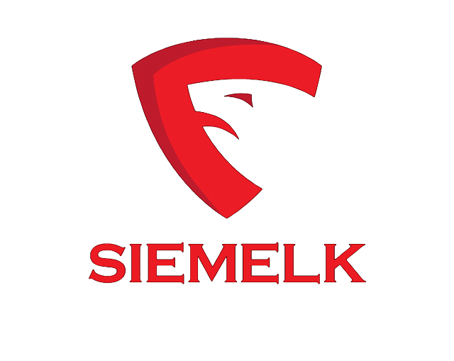

# SIEMELK

 

SIEMELK is a SIEM solution based on the ELK stack with many added alternative applications and customizations. It's free and powerful, You will see

This SIEM is all based on microservices, it is built upon Docker and deployed on Linux.

**Lets go beyond a SIEM**

## Main Features
✔️ Host and Network Threat Hunting (sysmon + wazuh HIDS)

✔️ Embeded IDPS Service (suricata)

✔️ Netflow support (Elastiflow)

✔️ SCADA/ICS Protocols support (S7comm, Modbus, DNP3, Bacnet, Profinet, ENIP)

✔️ Alerting

✔️ Reporting

✔️ Anomaly Detection

✔️ Cyber Threat Intelligence (OpenCTI)

✔️ Incident Response Integration (Thehive4)

✔️ C&C connections detection

✔️ Network Scanning module (Web-map)

✔️ Cluster Management

✔️ The SIEM module supports:
- Fortinet (Fortigate, Fortiweb)
- Sophos (Sophos, Cyberoam)
- Cisco (Routers, Switches, ASA, FTD, FMC)
- Linux (security events, FIM)
- Windows (Sysmon, Security events)
- Netflow
- Suricata
- Host security analysis - Wazuh
- Login bruteforce attack detection
- MITRE ATT&CK tactics and techniques
- Portsecurity, ARP inspection, DHCP snooping

## How to Install?
  - 1st- Submit this form https://forms.gle/R81FMULEkFTJVSzMA.
  - 2nd- Reviewing your information.
  - 3rd- You will get the download link for iso installation file and a instruction to activate the application.

---------

# Stack
The minimum requierments to deploy the stack (Acceptable Performance)is shown in the table below:

| Role   | RAM   |   CPU |
| -------| ------|-------|
| OpenCTI| 8GB | 4  |
|Core service| 12GB | 8 |
|TheHive4| 2GB|1|
|Other| 2GB|1|

24GB of RAM + 2GB extra (Linux and services) = 26 GB of RAM.
14 Cores of CPU is Good to go.

## How to choose your stack?
your stack resources depends on many factors like :
- how many hosts do you want to monitor?
- how many network devices you have?
- how much EPS (Event Per Second) the SIEM should handle?

This table will help you to decide:

| RAM     | CPU         |    DISK | EPS| Entire need|
| ---------| ------      |-------|----|----|
|16GB|8|300GB|1000-1500| 24GB RAM|
|24GB|8|500GB|1500-3000| 32GB RAM|
|32GB|12|1TB|3000-4000| 40GB RAM|
|48GB|16|2TB|4000-8000|56GB RAM|
|64GB|24|+2TB|+8000|72GB RAM|

⚠️ **NOTE: The Netflow module requiers a very good performance of your machine. (SSD Disks are recommended)**
