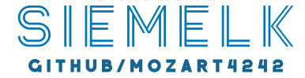

# SIEMELK

 

COMING SOON,

SIEMELK is a SIEM solution based on the ELK stack with many added alternative applications and customizations. It's free and powerful, You will see

This SIEM is all based on microservices, it is built upon Docker and deployed on Linux.

**Lets go beyond a SIEM**

## Main Features
✔️ Host and Network Threat Hunting (sysmon + wazuh HIDS)

✔️ Embeded IDPS Service (suricata)

✔️ Netflow support (Elastiflow)

✔️ SCADA/ICS Protocols support (S7comm, Modbus, DNP3, Bacnet, Profinet, ENIP)

✔️ Alerting

✔️ Reporting

✔️ Anomaly Detection

✔️ Cyber Threat Intelligence

✔️ The SIEM module supports:
- Fortinet (Fortigate, Fortiweb)
- Sophos (Sophos, Cyberoam)
- Cisco (Routers, Switches, ASA, FTD, FMC)
- Linux (security events, FIM)
- Windows (Sysmon, Security events)
- Netflow
- Suricata
- Host security analysis - Wazuh
- Login bruteforce attack detection
- MITRE ATT&CK tactics and techniques
- Portsecurity, ARP inspection, DHCP snooping

✔️ Incident Response Integration (Thehive4)

✔️ C&C connections detection

## How to Install?
  - 1st- Submit this form https://forms.gle/R81FMULEkFTJVSzMA.
  - 2nd- Reviewing your information.
  - 3rd- You will get the download link for iso installation file and a instruction to activate the application.

## More to come
This Repository is not completed and i am working on it. once the product is ready i will update this Repo.
