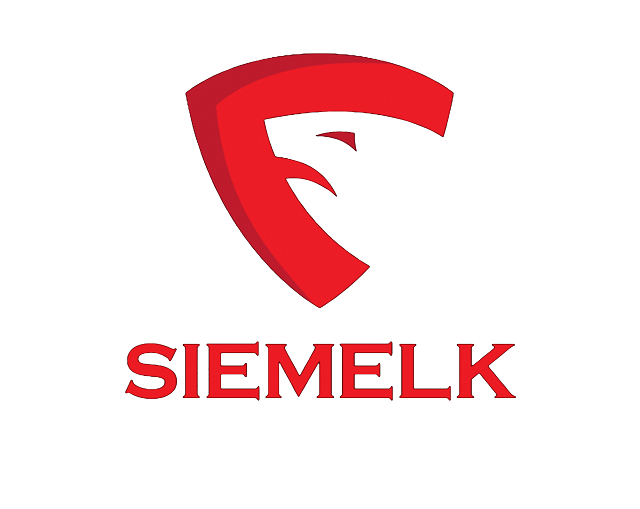

# SIEMELK

 

📌 SIEMELK is a customizable and scalable Security Monitoring Software Solution that is accessible to small, medium amd enterprise organizations.

📌 SIEMELK is built on the best of Open Source tools with extra functionality, integration stability and correlation providing enriching data from the SIEM.

<h1 align="center">
Lets go beyond a SIEM
</h1>

## [Product Overview](features.md)

## SIEMELK Features
✔️ Open Distro for Elasticsearch + Kibana + Logstash

✔️ Host and Network Threat Hunting (sysmon + wazuh)

✔️ Embeded IDPS Service (suricata)

✔️ Netflow support (Elastiflow)

✔️ SCADA/ICS Protocols support (S7comm, Modbus, DNP3, Bacnet, Profinet, ENIP)

✔️ Alerting

✔️ Reporting

✔️ Anomaly Detection

✔️ Cyber Threat Intelligence (OpenCTI)

✔️ Incident Response Integration (Thehive4)

✔️ Observables Analyzer (Cortex)

✔️ C&C connections detection

✔️ Network Scanning module (Web-map)

✔️ Cluster Management

✔️ SOAR Operations (Shuffle)

✔️ The SIEM module supports:
- Fortinet (Fortigate, Fortiweb)
- Sophos (Sophos, Cyberoam)
- Cisco (Routers, Switches, ASA, FTD, FMC)
- Linux (security events, FIM)
- Windows (Sysmon, Security events)
- Netflow
- Suricata (IDSTower + 1 year free license)
- Host security analysis - Wazuh
- Login bruteforce attack detection
- MITRE ATT&CK tactics and techniques
- Portsecurity, ARP inspection, DHCP snooping

----
## How to Install?
  - 1st- Submit this form https://forms.gle/R81FMULEkFTJVSzMA.
  - 2nd- Reviewing your information.
  - 3rd- You will get the download link for the iso installation file and a instruction to activate the application.

---------

# Stack
The minimum requierments to deploy the stack (Acceptable Performance)is shown in the table below:

| Role   | RAM   |   CPU |
| -------| ------|-------|
| OpenCTI| 8GB | 4  |
|Core service| 12GB | 8 |
|TheHive4| 2GB|1|
|Other| 4GB|2|

24GB of RAM + 2GB extra (Linux and services) = 26 GB of RAM.
14 Cores of CPU is Good to go.

## How to choose your stack?
your stack resources depends on many factors like :
- how many hosts do you want to monitor?
- how many network devices you have?
- how much EPS (Event Per Second) the SIEM should handle?

This table will help you to decide:

| RAM     | CPU     |  DISK | EPS| Entire need|
| --------| ------ |-------|----|----|
|32GB|12|1TB|3000-5000| 40GB RAM|
|48GB|16|2TB|5000-10000|56GB RAM|
|64GB|24|2TB+|10000+|72GB RAM|

⚠️ **NOTE: The Netflow module requiers a very good performance of your machine. (SSD Disks are recommended)**

## To Do
- Adding ability to upload your configuration files from web
- Adding ability to add replicas to your Elasticsearch form web
- Adding Message Queuing – Kafka
