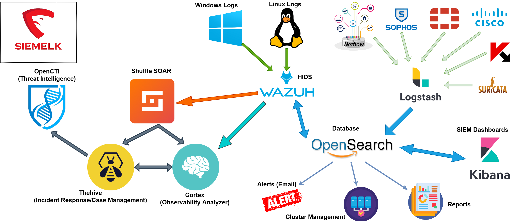

# SIEMELK

 

📌 SIEMELK is a customizable and scalable Security Monitoring Software Solution that is accessible to small, medium amd enterprise organizations.

📌 SIEMELK is built on the best of Open Source tools with extra functionality, integration stability and correlation providing enriching data from the SIEM.

📌  SIEMELK IS **NOT** AN **OPEN-SOURCE** PLATFORM

<h1 align="center">
Lets go beyond a SIEM
</h1>

## [Product Overview](features.md)

## SIEMELK Architecture

 

## SIEMELK Features
✔️ Open Distro for Elasticsearch + Kibana + Logstash

✔️ Host and Network Threat Hunting (sysmon + wazuh)

✔️ Embeded IDPS Service (suricata)

✔️ Netflow support (Elastiflow)

✔️ SCADA/ICS Protocols support (S7comm, Modbus, DNP3, Bacnet, Profinet, ENIP)

✔️ Alerting

✔️ Reporting

✔️ Anomaly Detection

✔️ Cyber Threat Intelligence (OpenCTI)

✔️ Incident Response Integration (Thehive4)

✔️ Observables Analyzer (Cortex)

✔️ C&C connections detection

✔️ Network Scanning module (Web-map)

✔️ Cluster Management

✔️ SOAR Operations (Shuffle)

✔️ The SIEM module supports:
- Fortinet (Fortigate, Fortiweb)
- Sophos (Sophos, Cyberoam)
- Cisco (Routers, Switches, ASA, FTD, FMC)
- Linux (security events, FIM)
- Windows (Sysmon, Security events)
- Netflow
- Suricata (IDSTower + 1 year free license)
- Host security analysis - Wazuh
- Login bruteforce attack detection
- MITRE ATT&CK tactics and techniques
- Portsecurity, ARP inspection, DHCP snooping

----
## How to Install?
  - 1st: Submit this form https://forms.gle/R81FMULEkFTJVSzMA.
  - 2nd: Download OVA package.
  - 3rd: Deploy OVA package on your Virtual machine platform (Recommended: VMware ESXI, Workstation, Vsphere)
  - 4th: Power on the VM
  - 5th: Login as:
    - **user: siemelk**
    - **password: siemelk**
  - 6th: Run this command:
    - **"sudo bash setup.sh"**
  - 7th: You are ready to go, happy hunting.
    - **https://ip**
  
  ---------

# Stack
The minimum requierments to deploy the stack:

- 32GB of RAM + 4GB extra (Linux and services)
- 8 Cores of CPU is Good to go.

## How to choose your stack?
your stack resources depends on many factors like :
- how many hosts do you want to monitor?
- how many Endpoints you have?
- how much EPS (Event Per Second) the SIEM should handle?

This table will help you to decide:

| RAM     | CPU    |  DISK | EPS| Entire Need| Stack|
| --------| ------ |-------|----|------------|-----|
|32GB|12|1TB|3K-5K| 40GB RAM| Free|
|48GB|16|2TB|5K-10K|56GB RAM|Paid|
|64GB|24|2TB+|10K+|72GB RAM|paid|

⚠️ **NOTE: The Netflow module requiers a very good performance of your machine. (SSD Disks are recommended)**

------

## Pricing
**SIEMELK** is free to download and use, but if you need the 100% power of SIEMELK for your SOC, then consider the table below:

|Feature/Edition|Free|Enterprise|
|-------|----|----------|
|Platform: |VM|VM|
|Endpoints: |1-200|Up to 1K|
|EPS:|5K|Up to 100K|
|Base SIEM: | ✅| ✅|
|Reports: | ✅| ✅|
|Host Intrusion Detection: | ✅| ✅|
|Cluster Management: | ✅|✅ |
|Anomaly Detection:| ✅| ✅|
|Alerting: |✅ |✅ |
|Network Scanning Module: |❌ | ✅|
|Network Intrusion Detection: |❌ |✅ |
|Upgradeable: | ❌|✅|
|Kubernetes Scalable: |❌ | ✅|
|Threat Intelligence: |❌ | ✅|
|Incident Response: | ❌| ✅|
|SOAR: | ❌| ✅|
|Observability Analyzer: | ❌| ✅|

------
## Why should i get a license?
✔️ To benefit the full functionality of SIEMELK

✔️ To support me :)

✔️ Price ?? As You Wish :)

### Crypto wallet address (Tether - USDT)

**Scan this QR code:**

 

**OR**

💲​Send through this address:

**ethereum:0xb53e6c5B1020aBaD81EC26532b1C585071848076?req-asset=0xdac17f958d2ee523a2206206994597c13d831ec7**

# Download
Download The OVA template and deploy it to your VMware infrastructure.
|Release|Size|Package|
|-------|----|-------|
SIEMELK-v1.0|36 GB| ova|

## To Do
- Adding ability to upload your configuration files from web
- Adding ability to add replicas to your Elasticsearch form web
- Adding Message Queuing – Kafka
- Adding OpenCTI integration
