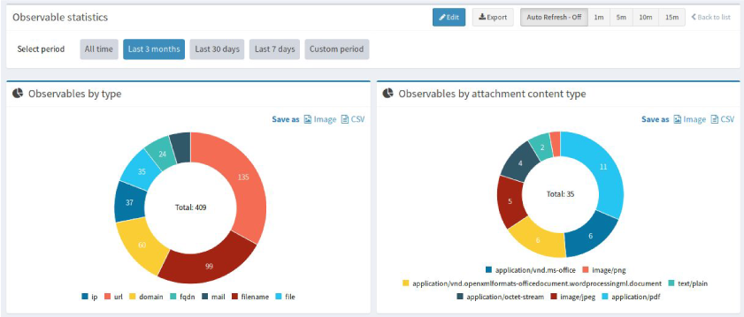
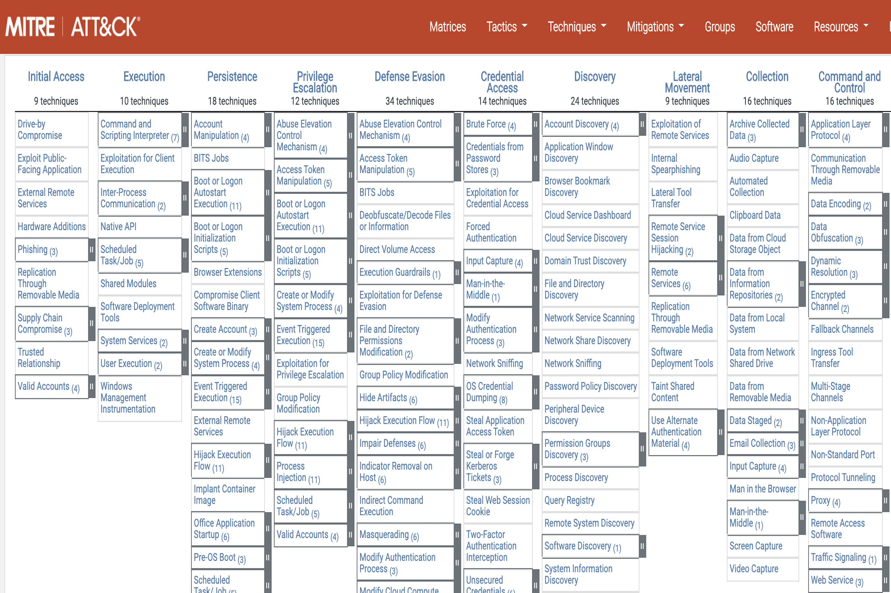
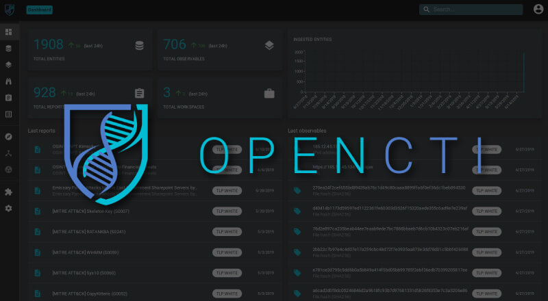
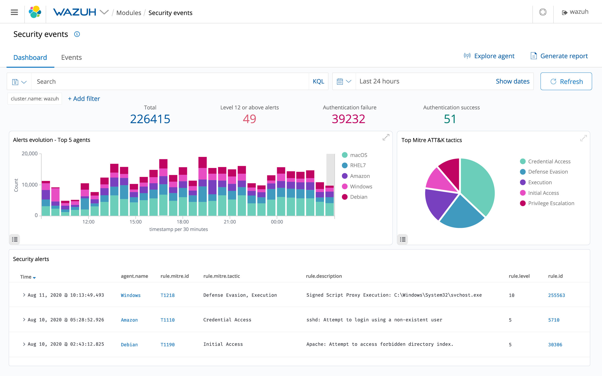
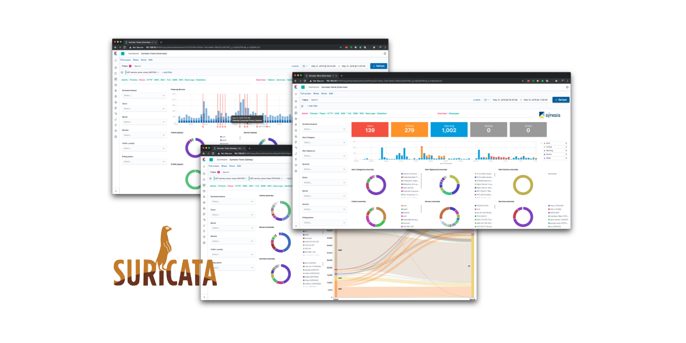

## Built On Open Source
SIEMELK is built on the best of Open Source tools with extra functionality, integration stability and correlation providing enriching data from the SIEM.
Some of these tools include.

### Open Distro
Open Distro for Elasticsearch provides a powerful, easy-to-use event monitoring and alerting system, enabling you to monitor your data and send notifications automatically to your stakeholders. With an intuitive Kibana interface and powerful API, it is easy to set up and manage alerts. Build specific alert conditions using Elasticsearch’s query and scripting capabilities. Alerts help teams reduce response times for operational and security events.

 

-----

### The Hive
TheHive is utilized within the SIEMELK platform as an incident response/case management system. It is meshed with Alerting, MISP, OpenCTI, Patrowl and Cortex to automate the process of incident creation. To make life simpler for SOCs, CSIRTs and CERTs, all information pertaining to a security incident is presented for review. Whilst weighing up and excluding false positives, the SOC team are given an indication of next steps to take.

 

-----

### MITRE ATT&CK
MITRE ATT&CK is a globally accessible knowledge base of adversary tactics and techniques based on real-world observations. The ATT&CK knowledge base is used as a foundation for the development of specific threat models and methodologies in the private sector, in government, and in the cybersecurity product and service community.

 

------
### OpenCTI
OpenCTI is an open source platform allowing organizations to manage their cyber threat intelligence knowledge and observables. It has been created in order to structure, store, organize and visualize technical and non-technical information about cyber threats.

The structuration of the data is performed using a knowledge schema based on the STIX2 standards. It has been designed as a modern web application including a GraphQL API and an UX oriented frontend. Also, OpenCTI is integrated with MISP, TheHive and MITRE ATT&CK within the SIEMELK platform as well as having a connector for CVE information.

 

------

### Message Queuing – Kafka
Apache Kafka is a publish/subscribe message queuing system that is utilized within SIEMELK not only for its scalability but also for the following:

1- Provides durable, fast and fault tolerant message streaming for handling real time data feeds.

2- Compatible with Apache Nifi and the Elastic Beats family agents.

3- Enables custom configuration per endpoint group by using topic declarations.

4- Improving data governance and guaranteed delivery.

5- Options for in flight stream data extraction and new stream creation dependent on specific triggers.

6- Ability to set data retention periods per use case in case of upstream processing back pressure.

 

-----

### Wazuh
Wazuh is a free and open source platform for threat detection, security monitoring, incident response and regulatory compliance. It can be used to monitor endpoints, cloud services and containers, and to aggregate and analyze data from external sources. Wazuh is used to collect, aggregate, index and analyze security data, helping organizations detect intrusions, threats and behavioral anomalies.

 

-----

### Suricata
Suricata is an open source threat detection engine that was developed by the Open Information Security Foundation (OISF). Suricata can act as an intrusion detection system (IDS), and intrusion prevention system (IPS), or be used for network security monitoring. It was developed alongside the community to help simplify security processes. As a free and robust tool, Suricata monitors network traffic using an extensive rule set and signature language. Suricata also features Lua scripting support to monitor more complex threats.

SIEMELK provides a Suricata pipeline that performs packet capture and analysis on the local network interface, acting as a host-based IDS. The resultant data is then sent to Kafka before being ingested by Elasticsearch. The commercial SIEMELK releases extend these capabilities in the form of network and cloud tabs and multi-network interface monitoring.

SIEMELK uses the power of IDSTower plus 1-year free full-featured license.
 
Alerts can be easily configured for signature matches and there is also dashboards provided for further IDS analysis.

 

 

-----
### Shuffle SOAR
SIEMELK using Shuffle SOAR (Security Orchestration, Automation, and Response). has included the bleeding edge Shuffle SOAR technology that will allow for the creation of workflows that can integrate with applications that form part of the SIEMELK stack, as well as external products that are often found as part of the cyber security toolsets deployed within the enterprise. SIEMELK have auto-wired to Cortex, TheHive & MISP. SOAR give your SIEM automation to create tickets, add Threat Intelligence Information as well as artifacts. SOAR provides automated workflows through a graphical interface with no coding required. Shuffle SOAR has thousands of premade integrations and uses open frameworks. Pulling data via API calls from all your sources makes for integration in hours rather than weeks or months. Raise tickets in commercial products or send emails to key stakeholders – choose from more than 11,000 application APIs to integrate into SIEMELK.

 

 

-----
### Cortex 
Cortex solves two common problems frequently encountered by SOCs, CSIRTs and security researchers in the course of threat intelligence, digital forensics and incident response:

- How to analyze observables they have collected, at scale, by querying a single tool instead of several?
- How to actively respond to threats and interact with the constituency and other teams?

Cortex can analyze (and triage)observables at scale using more than 100 analyzers. you can actively respond to threats and interact with your constituency and other parties thanks to Cortex responders. Within the SIEMELK platform Cortex is pre-integrated with TheHive and MISP to get you up and running.

